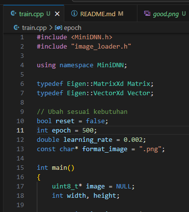

# 102b-nosrep-tcatnoc

Ayo kita coba buat ChatGPT sendiri!. Program ini adalah generative machine learning introduction di C++ buat dapetin no WA ku. Mari kita belajar cara membuat model AI secara sederhana, asik untuk percobaan. Model akan mempelajari tulisan tangan kalian dan akan menulis no WA ku dengan tulisan tangan kalian!

## Buat yang Error!!!!!
- Clone / download ulang project github ini
- Terdapat file bernama `eigen-3.4.0.zip`, sudah tersedia di sini
- Extract `eigen-3.4.0.zip` ke dalam folder ini
- 
- Maka akan muncul folder ini
- 
- Selamat training!

## Persyaratan
- Sudah terinstall MinGW di laptop, bisa di cek dengan mengetikkan `g++ --version` di terminal / cmd. Jika menampilkan hasil seperti dibawah, maka sudah bisa menjalankan program
- 

## Persiapan Dataset
1. Tulis angka 0 sampai 9 pada kertas putih (wajib putih), dengan tinta hitam
2. Crop gambar angka 0 - 9 sedemikian rupa sehingga background benar2 hanya putih, dan angka berwarna hitam terbaca jelas
3. Perlu diperhatikan nama file haruslah sesuai, gambar 0 maka namanya haruslah `0.png` / `0.jpeg` dst
- Contoh yang kurang bagus:
- 
- Contoh yang bagus:
- 
- Biar gampang, pakai whatsapp, crop sblm kirim gambar, download.
- Semakin putih background, semakin bagus
- Semakin tebal dan hitam tulisan, semakin bagus
- Bisa coba gunakan spidol atau tebalkan tulisan kamu
3. Masukkan semua foto tersebut ke dalam folder bernama `number`
- 
4. Hafalkan format gambar kalian, apakah itu `.png`, atau `.jpg`, atau `.jpeg`

## Tata Cara menjalankan
1. Jalankan file `main.bat`, bisa dengan cara double click di Windows Explorer / Folder, atau dengan cara mengetikkan di terminal / cmd. (Juga bisa buka di VSCode)
- 
2. Jika kalian menggunakan terminal / cmd / VSCode, muncul tulisan ini
- 
- Juga akan muncul file nomorku.png, tapi masih hitam saat ini
- 
3. Sekarang buka file `train.cpp`, dan lihat isi codingnya
- 
- Sesuaikan format_image dengan gambar yang tadi kamu pakai, apakah itu `.png`, atau `.jpg`, atau `.jpeg`
4. Sekarang jalankan `train.bat` sama seperti di awal, pada terminal / cmd / VSCode
- 
- Dan hasilnya akan seperti ini
- 
- Disini loss nya sekitar 15 an
5. Jalankan lagi `main.bat`, dan akan menampilkan `nomorku.png`
- 
- Hasil `nomorku.png` masih jelek!
- 
6. Sekarang jalankan `train.bat` dan `main.bat` berulang-ulang sampai terbaca `nomorku.png`. Incarlah loss sampai di angka 1 atau 0. Karena loss mendekati 0 artinya model sudah belajar maksimal.
- Biar kalian gak capek menjalankan `train.bat` dan `main.bat` berulang-ulang, coba edit file `train.bat`.
- 
- **Epoch**. Artinya Model di train sebanyak 500 kali perulangan. Bisa kalian ubah menjadi lebih banyak
- **Learning Rate**. Artinya seberapa cepat model belajar? Angka 0.001 - 0.01 umumnya yg sering dipakai. Karena jika learning rate terlalu besar, belajarnya AI akan lompat2 sana sini. (Akan kalian pelajari di mata kuliah Metode Numerik)
- **Format Image** jangan lupa ubah ke sesuai format foto kalian

Silahkan mencoba!